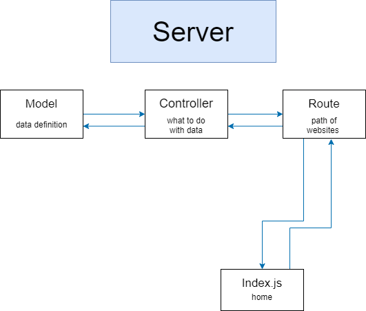

# Backend

## Get started
1. open a terminal in the root directory of the project and type  
    ```sh
    cd server
    npm install
    ```    
    after it is done installing make a file named ```.env``` in the server folder and add
    ```
    CONNECTION_URL = <url to your mongodb cluster>
    POST = 5000
    ```
    now type
    ```sh
    npm start
    ``` 
    and it should start the server can tell you the port if you did everything correctly
    ```sh
    Port: http://localhost:5000
    ```

    now you can visit
    ``` http://localhost:5000/data/posts```
    to see al the posts in you db
## index.js
This is what you cna call the home of our app our server starts from here and all the backend functionality is called/used from here

to read: 
1. [app.use](https://expressjs.com/en/guide/using-middleware.html) 
2. [.then](https://javascript.info/promise-chaining)
## routes 
this contains all the routing functionality like if we visit http://localhost:5000/data/posts what should happen this is complemented by [controllers](#controllers) which control what happens when we visit http://localhost:5000/data/posts 

this division between routes and controllers is done so that our routes is easy to read and clean

```js
/*
here if we visit http://localhost:5000/data/posts 
it will call the getPosts which is defined in the controller
*/
router.get("/posts", getPosts)
```

## controllers
these control what should happen if we visit a link
here if we visit [this](http://localhost:5000/data/posts)
which is essentially a get request on the link which has been programmed to show all the posts in our database

you can read about async functions [here](https://www.w3schools.com/js/js_asynchronous.asp)

in its essence we use async functions on parts of code that might take some time to execute(like fetching data from db) and run them parallelly with the rest of the code so that the rest of our website stays functional while the fetching from db is also happening 
```js
export const getPosts = async (req, res) => {
  try {
    const postSchema = await PostSchema.find()

    res.status(200).json(postSchema)
  } catch (error) {
    res.status(404).json({ message: error })
  }
}
```
read about try and catch [here](https://www.w3schools.com/js/js_errors.asp) 

## models
MongoDB stores data in JSON-like documents

It is a type of NoSql which means it doesn't store data in tables like sql
so it doesn't have a definition(required fields that need to be filled)
for our data we can skip fields or put numbers in name if we want 

thats where mongoose comes in
it provides schema-based solution to model our application data i.e we can give definition/criteria to our data 
like 
```js
const postSchema = mongoose.Schema({
  Title: String,
  Author: String,
  Content: String,
  Date: String,
})
```

## flow 


